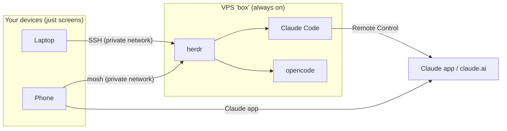

# Spec: Run Claude Code and opencode on a VPS

Updated 2026-09-26.
Checked against the Claude Code, opencode, herdr, and Tailscale docs, plus a handful of people's published VPS setups.

## The problem

Right now Claude Code and opencode run on the laptop.
When the laptop loses wifi or goes to sleep, the agents stop mid-task.
I want them to keep working no matter what the laptop is doing.

## The idea

Rent a small Linux server that's always on (a VPS), and run the agents there.
The laptop and phone just connect to it and show you what's going on.
If your connection drops, nothing on the server notices.
When you're back online, you reconnect and everything is right where it was.



What happens when the wifi drops:

```text
laptop loses wifi
  laptop's connection to the box closes
  box: nothing changes, agents keep working
laptop gets wifi back
  herdr --remote box
  you're back in the same panes, with everything the agents did while you were gone
```

## Quick refresher: the pieces

| Piece | What it is | Why we need it |
|---|---|---|
| VPS | A Linux computer you rent in a data center, about $48/month for the size you need. | It's always on and has fast internet. |
| Tailscale | A private network between your own devices. Free for personal use. | The box is invisible to the public internet. Only your laptop and phone can reach it. |
| herdr | The terminal multiplexer you already use (like tmux). | Keeps the agent panes running on the box after you disconnect. |
| mosh | SSH that survives flaky wifi, switching networks, and sleep. | Makes the phone (and bad hotel wifi) usable. |
| Remote Control (`claude --rc`) | Claude Code feature that lets the Claude app drive a running session. | Approve prompts or reply from your phone without a terminal. |

## Options

| Option | Where the agent runs | Has your full config? | Keeps going when laptop's offline? | Good for |
|---|---|---|---|---|
| **A. VPS + herdr** (recommended) | Your VPS | Yes, once you apply your Stow packages there | Yes | Everyday work with both agents |
| B. Claude Code on the web (`claude --cloud`) | Anthropic's servers | Only what's checked into the repo | Yes | One-off Claude tasks on a GitHub repo |
| C. Remote Control on the Mac | Your Mac | Yes | No, stops when the Mac sleeps | Phone access while you're at home |

**Why not B:** each session starts in a fresh VM with just the repo.
It doesn't get your global agent rules, your shared skill catalog, user-level plugins, hooks, or MCP servers added with `claude mcp add`.
It's Claude only, so no opencode.

**Why not C alone:** it reconnects after a wifi blip, but a sleeping Mac still stops the work.
It's still worth using on top of A, for the phone.

## Setup

### 1. Pick a server

Provider: **DigitalOcean**, Basic Droplet, in the US region closest to you (New York or San Francisco).

#### How big?

Here's what your setup uses on the Mac today, measured 2026-09-26:

| What | Memory (RAM) | Disk |
|---|---|---|
| Claude Code | ~400 MB per session (8 sessions = 3.2 GB) | `~/.claude`: 717 MB, of which 273 MB is old session history |
| opencode | ~450 MB | `~/.config/opencode`: 187 MB, plus 2.2 GB of session data you don't need to copy |
| herdr | ~140 MB | tiny |
| Ruby LSP, Node tools | ~1.4 GB | |
| dotfiles repo | | 1.2 GB |
| opto2 repo | | 1.0 GB |

On the box, add Ubuntu itself (~0.5 GB RAM), Postgres, and whatever Rails or Docker need while running tests.

| Size | Price | Disk | Verdict |
|---|---|---|---|
| 2 vCPU / 4 GB | $24/mo | 80 GB | Too tight. Three Claude sessions, opencode, and a Rails test run already hit ~4 GB, and Linux kills processes when it runs out. |
| **4 vCPU / 8 GB** | **$48/mo** | **160 GB** | **Get this.** Room for 4–6 agent sessions plus a Rails app and Postgres. |

Disk is not the problem: your config and repos are under 5 GB, and even with Ruby, Node, Postgres, and Docker images you'll use 20–40 GB.
You can resize the CPU and RAM later from the DigitalOcean dashboard (it takes a reboot).

#### Always on, or only when you need it?

DigitalOcean bills by the second, but **a powered-off Droplet still costs full price**.
The only way to stop paying is to snapshot it (save a copy of the disk) and delete it.
Bringing it back means creating a new Droplet from that snapshot.

| | Always on | On demand |
|---|---|---|
| Cost | $48/mo | ~$0.07/hr while it exists, plus ~$1.50/mo to keep a 25 GB snapshot. 10 hrs × 22 days ≈ **$17/mo**. |
| Start of day | Nothing, it's already running | `box up`: create from snapshot, about 1–2 minutes |
| End of day | Nothing | `box down`: snapshot, then delete, a few minutes |
| Agents running overnight | Yes | No, `box down` stops them |
| Survives your wifi dropping during the day | Yes | Yes, while the box is up |

Tailscale keeps its identity in the snapshot, so the rebuilt box comes back as `box` even though its public IP changes.
Both scripts are a few lines with `doctl`, DigitalOcean's command-line tool:

```text
box up
  doctl compute droplet create box --image <latest-snapshot> --size s-4vcpu-8gb --region nyc3 --wait
  wait until "ssh box" answers over Tailscale
box down
  refuse if any herdr pane is still working
  doctl compute droplet-action snapshot <id> --snapshot-name box-<date> --wait
  doctl compute droplet delete <id>
  delete older snapshots, keep the newest 2
```

Suggestion: run it always on for the first couple of weeks, until the setup feels solid.
Then switch to on demand if you find you never leave agents running overnight.

Connecting and disconnecting is the easy part either way: `herdr --remote box` to attach, `ctrl+a q` to detach.
Detaching doesn't stop anything on the box.

### 2. Create and lock down the box

On the box, logged in as root over the public IP the first time:

```text
create server: Ubuntu 24.04, your SSH public key, name it "box"
ssh root@<public-ip>
  create your user, give it sudo, copy your SSH key to it
  apt update && apt upgrade
  apt install unattended-upgrades mosh git stow
  turn off automatic reboots          # a 3am reboot kills long agent runs
  install Tailscale, then: tailscale up --hostname box
Tailscale admin page
  turn off key expiry for "box"       # otherwise you get locked out every few months
from a second terminal
  ssh you@box                          # make sure this works first!
then close the public door
  no root login, no password login
  firewall: allow Tailscale, block public SSH
  provider firewall: allow only UDP 41641 (Tailscale)
check from outside Tailscale
  ssh root@<public-ip>                 # should time out
```

If you lock yourself out, the provider's web console still gets you in.

### 3. Install the tools and apply your dotfiles

On the box, as your user:

```text
install herdr, claude (native installer), opencode, gh
git clone your dotfiles to ~/code/personal/dotfiles   # opencode plugin paths expect this spot
scripts/stow.sh dry-run
scripts/stow.sh apply        # links every package, same as on the Mac
then the stuff that isn't in git:
  ~/.config/bash/local.bash  # API keys for Ref, Exa, etc.
  claude                     # it prints a URL: open it on the laptop, paste the code back
  opencode auth login
  ssh-keygen                 # add this key to GitHub as "box", so agents can push
```

Notes:

- Log Claude in with your subscription, not an API key. Remote Control won't work with an API key.
- Give the box its own GitHub key. Forwarding your laptop's key stops working the moment the laptop disconnects, and you can revoke the box's key on its own.
- Don't run `scripts/bootstrap.sh` there. It's built around Homebrew on macOS.

### 4. Keep herdr running

The agents live inside the herdr server.
If it stops when you log out or the box reboots, they stop too.
Run it as a background service:

```ini
# ~/.config/systemd/user/herdr.service
[Unit]
Description=herdr server

[Service]
ExecStart=%h/.local/bin/herdr server
Restart=on-failure

[Install]
WantedBy=default.target
```

```bash
systemctl --user enable --now herdr
sudo loginctl enable-linger $USER    # keep your services running when you're not logged in
```

Keep this on the box for now. It can go into a Stow package once it's proven.

### 5. Start the agents

```text
from the laptop: herdr --remote box
  pane 1: cd ~/code/<project> && claude --rc "<project>"
  pane 2: cd ~/code/<project> && opencode
  detach with ctrl+a q
```

Run plain `claude` once in each project folder first, and accept the "trust this folder" prompt.
Remote Control won't start in a folder you haven't trusted.

### 6. Test the thing you actually care about

```text
give Claude a task that takes ~10 minutes
turn off the laptop's wifi, wait 5 minutes, turn it back on
herdr --remote box            # the task should have kept going
close the laptop
open the Claude app on your phone
  the session shows up with a green dot
  approve something from the phone
```

## From your phone (Galaxy Z Fold)

The Fold's inner screen is wide enough for a real terminal.
DeX plus a Bluetooth keyboard feels close to a laptop.

| For | Use | Notes |
|---|---|---|
| Private network | Tailscale app | Same account as the box |
| Terminal | Termux (from F-Droid) or Termius | Termux can run mosh |
| Full agent work | `mosh you@box`, then `herdr` | Picks up the same panes |
| Quick Claude replies and approvals | Claude app | Shows your `claude --rc` sessions |
| opencode in a browser | `https://box.<tailnet>.ts.net` | See below |

To get opencode in the phone's browser, run the web version on the box and share it on your Tailscale network only:

```bash
OPENCODE_SERVER_PASSWORD=... opencode web --hostname 127.0.0.1 --port 4096
tailscale serve --bg 4096
```

Use `opencode web`, not `opencode serve`.
`serve` is just the API with no web page.
Keep it on `127.0.0.1`: `0.0.0.0` also listens on the box's public address.
From the laptop, `opencode attach http://box:4096` works with either one.

Phone tips:

- herdr's prefix is `ctrl+a` in your config. Add it to Termux's extra-keys row, or use a keyboard.
- Give the phone its own SSH key, so a lost phone means removing one key.
- Use the Claude app for quick approvals and Termux for real work.

## Making the dotfiles work on both Mac and Linux

### What other people do

Most people who share one dotfiles repo between a Mac and Linux boxes use some mix of these, in this order:

1. **Don't hard-code paths.** Let the system find things: `$SHELL`, `$PATH`, `#!/usr/bin/env bash`, `~` instead of `/Users/you`. Most differences go away on their own.
2. **Small `if` checks in shell files**, like `if [[ "$(uname)" == Darwin ]]`, for the few spots that really differ (Homebrew setup, `open` vs `xdg-open`).
3. **A machine-local file that isn't in git**, loaded by the tracked file if it exists. You already do this with `~/.config/bash/local.bash`. Git config has the same trick (`[include] path = ~/.gitconfig.local`).

You only have a couple of Mac-only values, so these three are enough.
No need for a templating tool like chezmoi. Stow is fine.

### The actual changes (done 2026-09-26)

| File | Issue | Fix |
|---|---|---|
| `stow/herdr/.config/herdr/config.toml` | `default_shell = "/opt/homebrew/bin/bash"` doesn't exist on Linux. | **Changed to `default_shell = "bash"`.** herdr looks the name up on its `PATH`, which finds Homebrew Bash 5 on the Mac and the system Bash on Linux. Deleting the line didn't work: herdr then uses the `$SHELL` it started with, and a long-running herdr server can still have an old value (yours had `/bin/zsh`). |
| `stow/claude/.claude/settings.json` | The `autoMode.environment` "Trusted repo" line says `/Users/frshbb/code/optoai/opto2`. | Change it to `~/code/optoai/opto2`. These lines are plain-English notes to the auto mode checker, not exact path matches, so `~` works on both machines. The line already names the GitHub remote, which is the same everywhere. |
| `stow/bash/.config/bash/functions.bash` (`claude-log`) | Sets `ANTHROPIC_BASE_URL`, which turns Remote Control off. | No change. `claude-log` sends requests through your local request logger, and Remote Control only works when requests go straight to Anthropic. Use plain `claude --rc` for sessions you want on your phone. |

The opencode config is already fine: RepoPrompt was removed in commit 7e88c11, and there are no Mac-only paths left.
Your config also doesn't set any of the environment variables that disable Remote Control (`DISABLE_TELEMETRY`, `DO_NOT_TRACK`, `CLAUDE_CODE_DISABLE_NONESSENTIAL_TRAFFIC`, `DISABLE_GROWTHBOOK`). Keep it that way on the box.

## Status

### Done (2026-09-26)

- [x] Spec reviewed and approved.
- [x] Set `default_shell = "bash"` in `stow/herdr/.config/herdr/config.toml`, reloaded herdr, and confirmed new panes start Homebrew Bash 5.3.
- [x] Changed the auto mode "Trusted repo" path in `stow/claude/.claude/settings.json` to `~/code/optoai/opto2`.
- [x] `scripts/stow.sh dry-run` against an empty temporary home folder: no conflicts.
- [x] `scripts/validate-dotfiles.sh` and `test/stow_preflight_test.sh` pass.
- [x] Removed the old tmux, Fish, and opencode link cleanup from `scripts/stow.sh` (none of those links existed anymore).
- [x] Deleted the empty `stow/tmux/` folder. The archived tmux config lives in `old/tmux/`.

### Left to do

On the Mac:

- [ ] Commit the changes above.

Creating the box (setup steps 1–2):

- [ ] Create a DigitalOcean account and a 4 vCPU / 8 GB Basic Droplet (Ubuntu 24.04) named `box` in NYC or SFO.
- [ ] Create your user, update, and install `unattended-upgrades mosh git stow`. Turn off automatic reboots.
- [ ] Install Tailscale, join as `box`, and turn off key expiry for it.
- [ ] Confirm `ssh you@box` works over Tailscale, then lock down: no root or password login, block public SSH, DigitalOcean Cloud Firewall allows only UDP 41641.
- [ ] Confirm `ssh root@<public-ip>` times out.

Setting it up (setup steps 3–5):

- [ ] Install herdr, Claude Code, opencode, and `gh`.
- [ ] Clone the dotfiles to `~/code/personal/dotfiles`, run `scripts/stow.sh dry-run`, then `apply`.
  This is the first time `stow.sh` and `validate-dotfiles.sh` run on Linux, so expect small fixes.
- [ ] Add the stuff that isn't in git: `~/.config/bash/local.bash`, `claude` login, `opencode auth login`, and a new GitHub SSH key named "box".
- [ ] Add the herdr systemd user service and run `loginctl enable-linger`.
- [ ] Clone the project repos, and run `claude` once in each to trust the folder.

Testing (setup step 6 and phone):

- [ ] Wifi-off test from the laptop: the task keeps going and `herdr --remote box` reattaches.
- [ ] Claude app shows the `claude --rc` session and can approve a prompt.
- [ ] Phone: Tailscale + Termux, `mosh you@box`, then `herdr`. Add `ctrl+a` to the Termux extra-keys row and give the phone its own SSH key.
- [ ] Optional: `opencode web` behind `tailscale serve`, opened in the phone browser.

Later:

- [ ] After a couple of weeks, pick always on or on demand. If on demand, write `box up` / `box down` with `doctl`.
- [ ] Once the herdr service works, consider adding it to a Stow package.
